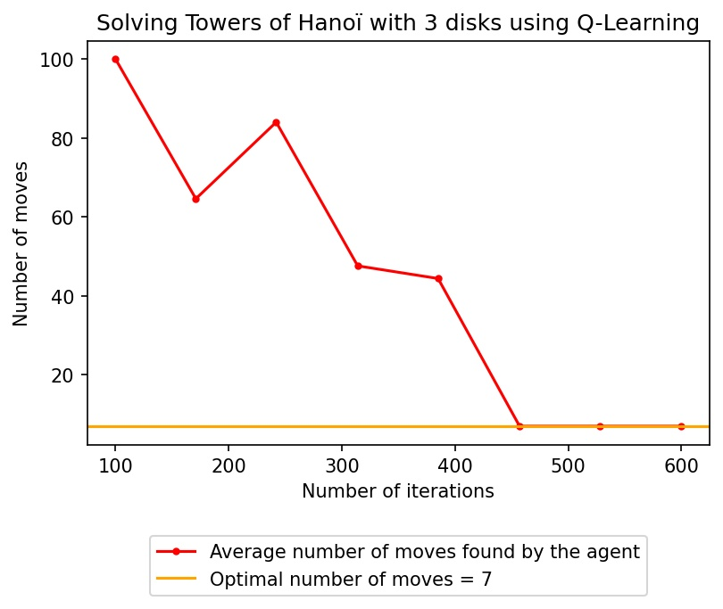

## Reinforcement Learning algorithms
An implementation of various reinforcement learning algorithms (Q-Learning, Deep Q-Learning, AlphaZero) on several games.

### AlphaZero
Working implementation of several games. See `AlphaZero` directory.

### Deep Q-Learning
Working implementation of the OpenAI cartpole game.

### Q-Learning
In order to use `agent.py` to perform Q-Learning on a game, you have to implement the interface located in `gamei.py`.
You can see example implementations in the `games` directory such as the Towers of Hanoï in `hanoi.py` or Connect 4 in `connect4.py`.

In `Q-Learning.ipynb` you will see two examples of usage of `agent.py`, one for Connect 4 (you can play versus it) and one
for the Towers of Hanoï.

Here are the results for the latter (100 moves means that the algorithm did not find a suitable solution (more than 100 moves)):

## License
[GPL v3](https://choosealicense.com/licenses/gpl-3.0/)
