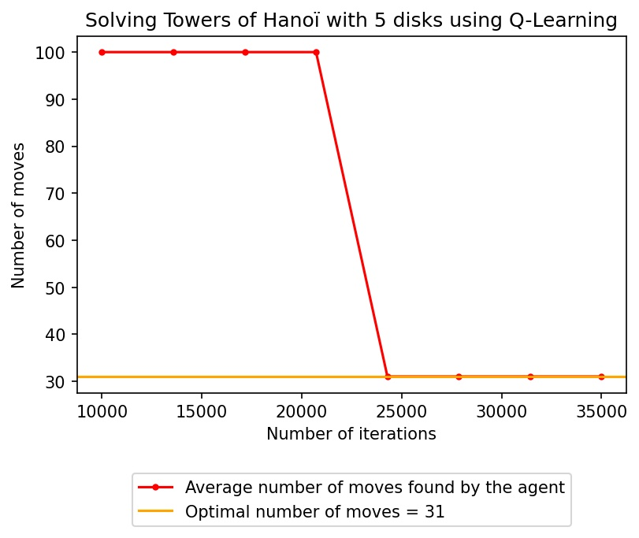

## Reinforcement Learning Tests

### Q-Learning
In order to use `agent.ipynb` to perform Q-Learning on a game, you have to implement the interface located in `gamei.py`.
You can see an example of an implementation of the Towers of Hanoï game in `hanoi.py`.
Here are the results (100 moves means that the algorithm did not find a suitable solution (more than 100 moves)):

